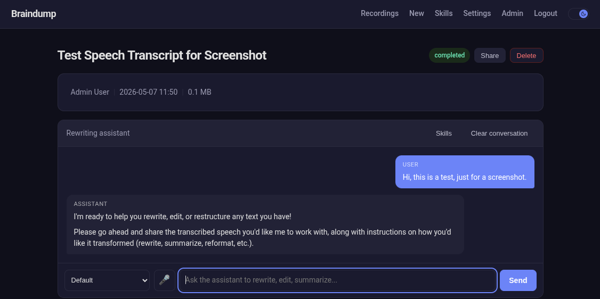

# Braindump

Braindump is not a quick voice memo app. It's for the longer stuff — the 5-minute explanation of an architecture you're considering, the 15-minute walkthrough of a problem you're stuck on, the detailed brain dump you do when you need to get everything out of your head and into something searchable. The name is literal: dump your brain, then work with what comes out.

Record audio in your browser, get it transcribed **on-device** (a local Whisper model — no API key, nothing leaves your machine), search across all your transcriptions, and refine the text with an inline AI rewriting chat. Runs fully local out of the box; add hosted services (OpenAI, PostgreSQL, SSO…) only when you want them. Built with Symfony, deployed on Upsun.



## Features

- **Audio Recording** — Record directly from the browser with microphone selection. Up to 25MB per recording (the OpenAI Whisper file size limit).
- **Automatic Transcription** — Audio is transcribed in the background. By default a local Whisper model (whisper.cpp) runs on-device with no API key; set `TRANSCRIBER=openai` to use the hosted OpenAI Whisper API instead. If the user left the title field blank, an LLM generates a short descriptive title when one is configured — otherwise the title falls back to the transcript's opening words. Status updates live via Mercure.
- **Full-Text Search** — PostgreSQL full-text search across titles and transcriptions, with configurable OpenSearch backend.
- **Rewriting Chat** — On the recording page, the transcript is fed to an AI assistant scoped to rewriting/editing. Stream replies appear inline, history persists across reloads, and there's a voice-input button (with mic device picker) for quick refinements. Supports multiple providers (Anthropic, OpenAI, Google, Groq, Mistral, DeepSeek, xAI, OpenRouter). Each user provides their own API key, stored encrypted via Upsun Vault KMS.
- **Skills** — Reusable context documents (tone guidelines, writing rules, persona definitions, domain knowledge) you define once on `/skills` and toggle on per chat. Activated skills get concatenated into the system prompt for every assistant call in that conversation — invisible in the message stream, but they shape every reply. Per-user, with a `(session, skill)` join table tracking which are active in each conversation.
- **Enterprise-Ready Auth** — Form login with per-user roles and permissions. OIDC for enterprise SSO coming soon.
- **Admin Back-Office** — EasyAdmin dashboard for user management.

## Infrastructure Architecture

### Why workers for transcription

Transcription requests to OpenAI with large audio files can take a very long time — minutes, not milliseconds. Running these in the HTTP request path would mean the user stares at a loading spinner for the entire duration, and the web server worker is occupied the whole time. Instead, the web request simply enqueues a job and returns immediately. A dedicated Symfony Messenger worker picks up the job, calls OpenAI, and updates the database when done. The user sees the status change in real-time via Mercure SSE.

This separation means the web application stays responsive regardless of how many transcriptions are queued, and if a transcription fails, it can be retried without user intervention.

### Why Mercure for real-time updates

Two flows publish events that the browser needs to receive live: the transcription worker reporting status changes, and the rewriting chat streaming AI tokens to every open tab on the same recording. Traditional PHP-FPM ties up one worker per open SSE connection — with limited workers, a handful of users staring at a chat would starve the rest of the app.

Mercure handles persistent SSE connections with async I/O, so the PHP application only does the publishing (a fast HTTP call to the hub) and never holds the long-lived browser connection itself. On Upsun, Mercure runs as a managed service on a dedicated subdomain, fully decoupled from the PHP-FPM tier.

### Why network storage for audio files

Audio files need to be accessible by both the web application (which receives the upload) and the transcription worker (which reads the file to send to OpenAI). On Upsun, the web container and worker containers are separate processes that don't share a filesystem. The `network-storage` service provides a shared mount that both can access, solving this cleanly without needing to store files in the database or an external object store.

### Why Vault KMS for API key encryption

Each user provides their own AI provider API key for the rewriting chat. These keys are sensitive credentials that must be stored encrypted at rest. On Upsun, the application uses the managed Vault KMS service for transit encryption — the key never exists in plaintext in the database or in application config. The encryption key is managed by the platform, rotated independently, and never leaves the Vault service.

### Why PostgreSQL LISTEN/NOTIFY for the message queue

Symfony Messenger needs a transport for async messages. The simplest option is Doctrine transport with PostgreSQL, which reuses the existing database — no additional service to provision, configure, or pay for. PostgreSQL's LISTEN/NOTIFY mechanism provides efficient push-based message delivery (the worker wakes up immediately when a message arrives, rather than polling on a timer). For the throughput this application needs, it's more than sufficient. RabbitMQ or Redis can be swapped in later if needed by changing a single DSN.

## Try it in one command (Docker)

No PHP, no PostgreSQL, no API keys — just Docker.

```bash
git clone <repo-url>
cd braindump
docker compose up --build
```

Open <http://localhost:8000> and log in with the seeded demo account:

- **Email:** `admin@example.com`
- **Password:** `password`

That's the whole app — record audio, get it transcribed **on-device** (local Whisper, no key), search, and start a rewriting chat (the chat itself needs an AI provider key; see [Add services as you grow](#add-services-as-you-grow)). The first build compiles whisper.cpp and downloads a model, so it takes a few minutes; later starts are quick. Compose bundles PostgreSQL and Mercure automatically.

## Run it locally without Docker

Minimum to boot the app: **PHP 8.4 + Composer**. SQLite is the default database, so PostgreSQL is *not* required.

```bash
git clone <repo-url>
cd braindump
composer install
php bin/console doctrine:migrations:migrate
php bin/console app:create-user you@example.com password "You" --admin
symfony server:start                 # or: php -S localhost:8000 -t public
```

To enable transcription, install **ffmpeg** and **whisper.cpp** (both on your `PATH`; override with `FFMPEG_BINARY` / `WHISPER_CLI`), download a model, and run the worker plus the Mercure hub for live updates:

```bash
php bin/console app:whisper:download              # base.en (~140 MB); try tiny.en/small too
./mercure run --config Caddyfile.mercure --adapter caddyfile
php bin/console messenger:consume async           # transcription worker
```

Running the tests:

```bash
php bin/phpunit
```

## Add services as you grow

Braindump runs fully local by default. Everything below is **opt-in** — enable it when you want it, in any order. Put secrets in `.env.local` (gitignored), never in `.env`.

| Want… | Set | Notes |
|---|---|---|
| **Faster / more accurate transcription** | `TRANSCRIBER=openai` + `OPENAI_API_KEY` | Uses the hosted OpenAI Whisper API instead of the local model. |
| **AI rewriting chat & LLM titles** | `OPENAI_API_KEY` (plus each user's own provider key, set in app settings) | Without an LLM, recordings are titled from their opening words. |
| **PostgreSQL** | `DATABASE_URL=postgresql://…` | Default is SQLite. The Docker setup uses the bundled Postgres. |
| **OpenSearch full-text search** | `SEARCH_PROVIDER=opensearch` + `OPENSEARCH_URL` | Default `database` auto-detects SQLite vs PostgreSQL — no extra service. |
| **Enterprise SSO (OIDC)** | `OIDC_ENABLED=1` + `OIDC_*` | Adds "Sign in with SSO" next to form login. |
| **Encrypted per-user API keys (Vault KMS)** | *(Upsun only)* | Locally, keys are encrypted with `APP_SECRET`; production uses Upsun Vault KMS. |

## Environment Variables

| Variable | Description | Default |
|---|---|---|
| `TRANSCRIBER` | Transcription backend: `local` (whisper.cpp, on-device) or `openai` (hosted API) | `local` |
| `WHISPER_CLI` | Path to the whisper.cpp CLI binary (used when `TRANSCRIBER=local`) | `whisper-cli` |
| `WHISPER_MODEL` | Path to the ggml model file | `var/whisper/ggml-base.en.bin` |
| `FFMPEG_BINARY` | Path to ffmpeg (transcodes recordings to 16 kHz WAV for whisper.cpp) | `ffmpeg` |
| `DATABASE_URL` | Database DSN (SQLite by default; set a `postgresql://…` URL to use Postgres) | SQLite (`var/data.db`) |
| `OPENAI_API_KEY` | **Optional.** Hosted Whisper (`TRANSCRIBER=openai`), LLM titles, AI chat, CI failure analysis | — |
| `MERCURE_URL` | Mercure hub URL (server-side) | — |
| `MERCURE_PUBLIC_URL` | Mercure hub URL (browser-side) | — |
| `MERCURE_JWT_SECRET` | JWT secret for Mercure | — |
| `SEARCH_PROVIDER` | Search backend: `database` (auto SQLite/Postgres) or `opensearch` | `database` |
| `OPENSEARCH_URL` | OpenSearch/Elasticsearch URL | — |
| `OPENSEARCH_INDEX` | OpenSearch index name | `braindump_recordings` |
| `OIDC_ENABLED` | Enable OIDC SSO (`1`/`0`) | `0` |
| `APP_SECRET` | Symfony app secret (used locally to encrypt API keys) | — |
| `UPSUN_API_TOKEN` | Upsun API token for CI automation (`app:ci-run`) | — |
| `CI_NOTIFICATION_EMAIL` | Recipient email for CI notifications | — |
| `CI_EMAIL_DOMAIN` | Optional domain for FROM address (`noreply@{domain}`). Falls back to `CI_NOTIFICATION_EMAIL` | — |
| `MAILER_DSN` | Mail transport (auto-set on Upsun from `PLATFORM_SMTP_HOST`) | `null://null` |

## Deployment on Upsun

The `.upsun/config.yaml` defines the full deployment:

- **Web application**: PHP 8.4 with PHP-FPM
- **Transcription worker**: Consumes the `async` Messenger transport — runs OpenAI Whisper transcription outside the HTTP request path
- **Weekly CI cron**: Runs `app:ci-run` — creates an Upsun environment, updates dependencies, runs `phpunit`. Auto-merges security fixes; sends an email with a merge link for non-security updates. On failure, sends the activity log to OpenAI for root-cause analysis and emails the results
- **PostgreSQL 16**: Primary database
- **Mercure**: Managed real-time hub (transcription status + chat streaming)
- **Network storage**: Shared audio file storage
- **Vault KMS**: Transit encryption for user API keys

```bash
upsun project:create
upsun push
```

Set environment variables via `upsun variable:create`.

## Tech Stack

- **Symfony** web framework
- **Symfony AI** (OpenAI Whisper) for speech-to-text
- **Symfony Messenger** for async transcription
- **Mercure** for real-time SSE (transcription status + AI reply streaming)
- **EasyAdmin** for back-office
- **PostgreSQL** with full-text search
- **Stimulus + Turbo** for frontend interactivity
- **marked + DOMPurify** for sanitized markdown rendering of AI replies
- **Provider SDKs**: direct calls to Anthropic Messages API + OpenAI-compatible chat completions (per-user encrypted keys)
- **Vault KMS** for API key encryption (transit encryption on Upsun)
- **Upsun** (formerly Platform.sh) for deployment
